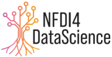

# Workshop on Machine Learning Good Practices
_[DOME recommendations](https://dome-ml.org/) for better Machine Learning in Computational Biology_

_virtually co-located with the [21st European Conference on Computational Biology (ECCB 2022)](https://eccb2022.org/)_

This discussion-based workshop will focus on (i) Standards for reporting Machine Learning approaches on Life Sciences, particularly the DOME recommendations, (ii) FAIRness for Machine Learning, and (iii) Best practices around Machine Learning. 

* When: 12 Sept 2022, 13:30 to 16:30 CEST ([starting](https://www.timeanddate.com/worldclock/fixedtime.html?iso=20220912T1130) and [ending](https://www.timeanddate.com/worldclock/fixedtime.html?iso=20220912T1430) time in your own time zone)
* Where: Connection details will be shared with registered attendees
* Registration: Visit the [ECCB 2022 registration page](https://eccb2022.org/registration/)
* [Description](#description)
* [Agenda](#agenda)
* [Invited speakers](#invited-speakers)
* [Organizing committee](#organizing-committee)
* [Sponsorship](#sponsorship)

## Description

Large amounts of biological data are continuously created, processed and transformed. Machine Learning (ML) algorithms have become one of the preferred approaches for data processing and understanding given their capacity to deal with large amounts of data. In Life Sciences, ML is used in a variety of fields with the potential of resulting in ground-breaking medical applications. However, there are some issues around reproducibility, transparency, explainability and so on that could, at least partially, be alleviated by consistently applying good practices reflected in good descriptions and documentation wrt the ML model. This workshop/SIG deals with good practices, guidelines and metadata for FAIR, reproducible and transparent ML in Life Sciences. In this first edition, we will focus on the [Data, Optimization, Model and Evaluation (DOME) recommendations](https://www.nature.com/articles/s41592-021-01205-4) for supervised ML in biology which aim at facilitating the assessment of the quality and reliability of reported models.

## Agenda

| Starting at (CEST) | Length | Activity | Participant | 
| ---------- | ------ | -------- | ----------- |
| 13:30 | 10’ | Welcoming and introduction to the workshop | Leyla Jael Castro | 
| 13:40 | 15’ | Standards for reporting ML in LS | Fotis Psomopoulos | 
| 13:55 | 15’ | FAIRness for ML | Daniel S. Katz |
| 14:10 | 05’ | Comfort break | All |
| 14:15 | 15’ | Challenges for AI in life sciences | Macha Nikolski | 
| 14:30 | 15’ | Invited talk | Purvesh Khatri | 
| 14:45 | 15’ | Invited talk | Chas Nelson | 
| 15:00 | 05’ | Comfort break | All |
| 15:05 | 10’ | Overview on challenges and opportunities (input gathered from participants)| Leyla Jael Castro |
| 15:15 | 60’ | Panel discussion on challenges and opportunities | Invited speakers and panelists | 
| 16:15 | 05’ | Comfort break | |
| 16:20 | 10’ | Wrap-up | Leyla Jael Castro | 
| 16:30 | 30' | Coffee break and finding the next workshop location | All |

## Invited speakers

| --- | --- |
|  Fotis Psomopoulos | Principal Investigator at the [Institute of Applied Biosciences, Centre for Research and Technology Hellas (CERTH)](https://www.inab.certh.gr/). His research interests lay across three major pillars; (1) Bioinformatics (Phylogenetic profiles and RNA-Seq data analysis) (2) data mining methods and big data techniques for Life Sciences data, and (3) Grid / Cloud Computing, and EGI resources in particular. |
|  Daniel S. Katz | Daniel S. Katz is Chief Scientist at the National Center for Supercomputing Applications (NCSA), Research Associate Professor in Computer Science (CS), Research Associate Professor in Electrical and Computer Engineering (ECE), Research Associate Professor in the School of Information Sciences (iSchool), and Faculty Affiliate in Computational Science and Engineering (CSE) at the University of Illinois Urbana-Champaign. He is also a Better Scientific Software (BSSw) Fellow and Guest Faculty at Argonne National Laboratory. His research interests are in applications, algorithms, fault tolerance, and programming in parallel and distributed computing, and policy issues, including citation and credit mechanisms and practices associated with software and data, organization and community practices for collaboration, and career paths for computing researchers. He co-founded the Journal of Open Source Software, the US RSE Association, and the Research Software Alliance (ReSA), and co-leads the FORCE11 Software Citation Implementation Working Group and the FORCE11/RDA/ReSA Fair for Research Software group. |
|  Macha Nikolski | Macha Nikolski is a Senior Research Scientist at the National Center for Scientific Research (CNRS), head of [Computation Biology and Bioinformatics](https://bordeaux-bioinformatics.fr/), head of Bordeaux Bioinformatics Center. She is also the co-lead of ELIXIR Cancer Focus Group. Her research interests are in the analysis of high-throughput omics and imaging data to elucidate the phenotype of interest. Methodological solutions are often a mix of algorithmics, machine and deep learning |
|  Purvesh Khatri | Associate Pofessor of Medicine and of Biomedical Data Science at  Santford University - [KathriLab](https://khatrilab.stanford.edu/)  |
|  Chas Nelson | Dr Chas Nelson is Founder & CTO of [gliff.ai](https://gliff.ai/) a company whose mission it is solve AI challenges to enable real-world solutions. [gliff.ai](https://gliff.ai/) offers software solutions that let teamsn come together to embed knowledge into high-quality, auditable medical imaging datasets for building world-changing and trustworthy AI |

## Organizing Committee

This discussion-focused workshop is organized by the [Machine Learning Focus Group](https://elixir-europe.org/focus-groups/machine-learning), part of the [ELIXIR Tools Platform](https://elixir-europe.org/platforms/tools).

| Name | Affiliation | Short description |
| ---- | ----------- | ----------------- |
| Jennifer Harrow | [ELIXIR Hub](https://elixir-europe.org/about-us/who-we-are/hub) | Tools Platform Coordinator at the ELIXIR Hub, which involves engaging with the ELIXIR community around strategic planning for benchmarking and tools registry software, the Galaxy community to provide workflows and also developing best practices for the developer community in Europe. She has co-organized multiple workshops (e.g., [FAIReScience 2021](https://researchsoft.github.io/FAIReScience/)) and hackathons on life sciences (e.g., [BioHackathon Europe 2018 to 2022](https://biohackathon-europe.org/)). | 
| Fotis E. Psomopoulos | [Institute of Applied Biosciences, Centre for Research and Technology Hellas](https://www.inab.certh.gr/) | Principal Investigator at the Institute of Applied Biosciences/Centre for Research and Technology Hellas. He has co-organized multiple workshops (e.g., [FAIReScience 2021](https://researchsoft.github.io/FAIReScience/), [RDA FAIR principles for Machine Learning 2021](https://www.rd-alliance.org/steps-towards-defining-fair-principles-machine-learning-ml)). | 
| Silvio Tosatto | [Università degli Studi di Padova](https://www.unipd.it/) | Professor in Bioinformatics and Principal Investigator at the BioComputing UP lab of the Dept. of Biomedical Sciences, Università degli Studi di Padova. |
| Leyla Jael G. Castro | [ZB MED Information Centre for Life Sciences](https://www.zbmed.de/en/), [NFDI4DataScience](https://www.nfdi4datascience.de/) | Semantic retrieval team leader at ZB MED Information Centre for Life Sciences in Cologne, Germany. She has participated in initiatives related to FAIRness for research software and recommendations for research open software. She has co-organized multiple workshops (e.g., [FAIReScience 2021](https://researchsoft.github.io/FAIReScience/), [DaMaLOS 2020 to 2022](https://zbmed.github.io/damalos/)) and hackathons on life sciences (e.g., [BioHackathon Europe 2018 to 2022](https://biohackathon-europe.org/)). |

&nbsp;&nbsp;&nbsp;&nbsp;&nbsp;&nbsp;&nbsp;&nbsp;&nbsp;&nbsp;&nbsp;&nbsp;&nbsp;&nbsp;&nbsp;&nbsp;&nbsp;&nbsp;&nbsp;&nbsp;

&nbsp;&nbsp;&nbsp;&nbsp;

